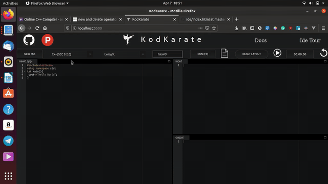
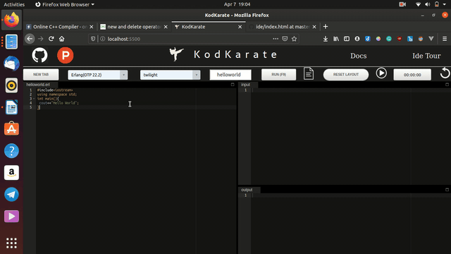
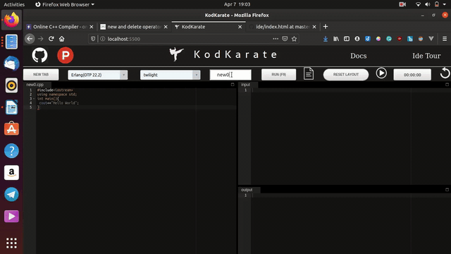
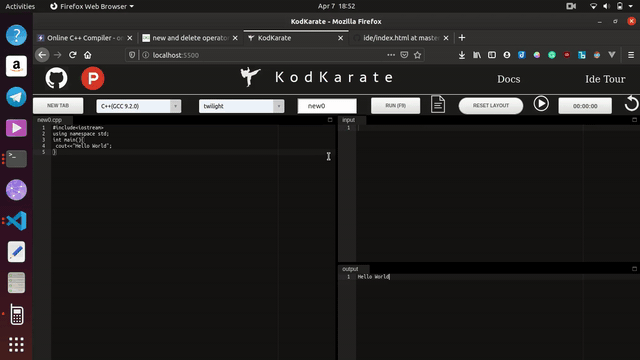
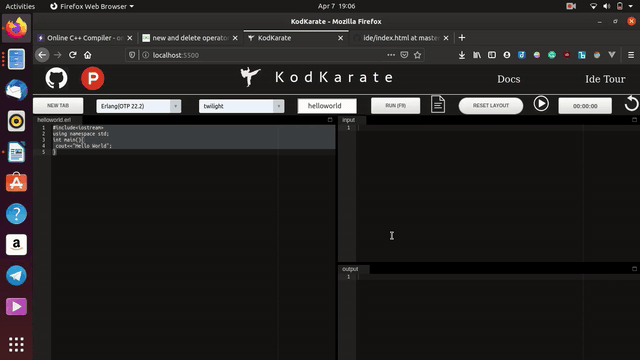

# कोड़कराते में आपका स्वागत है

## परिचय

कोड़कराते एक ओपन सोर्स आईडीई है, जो 21 प्रोग्रामिंग भाषाओं के समर्थन के साथ _Judge Api_ द्वारा संचालित है और आईडीई का उपयोग 17 थीम में किया जा सकता है।

प्रलेखन दो भाषाओं में आता है ** अंग्रेजी और हिंदी **

### समर्थित भाषाएँ: -

| Language                   |
| -------------------------- |
| C++(GCC 9.2.0)             |
| C(GCC 9.2.0)               |
| Java(OpenJDK 13.0.1)       |
| Python(2.7.17)             |
| Python(3.8.1)              |
| Rust(1.40.0)               |
| TypeScript(3.7.4)          |
| Prolog(GNU Prolog 1.4.5)   |
| Php(7.4.1)                 |
| Assembly(Nasm 2.14.02)     |
| Common lisp (SBCL 2.0.0)0) |
| D(DMD 2.089.1)             |
| Elixir(1.9.4)              |
| Erlang(OTP 22.2)           |
| Fortran(9.2.0)             |
| GO                         |
| Haskell(GHC 8.8.1)         |
| Lua(5.3.5)                 |
| Nodejs(12.14.0)            |
| OCaml(4.09.0)              |
| Octave(5.1.0)              |

### मल्टी टैब सपोर्ट

कोड़कराते एक मल्टीटाब विकास पर्यावरण का समर्थन करता है जिसमें एक ही समय में कई फ़ाइल पर काम करना संभव है।

### कोड डाउनलोड समर्थन

कोड़कराते आपको संबंधित प्रोग्रामिंग भाषा एक्सटेंशन में एक फ़ाइल डाउनलोड करने की अनुमति देने की क्षमता के साथ आता है ताकि आपके पास अपने कोड की एक वैध प्रतिलिपि हो सके।

### कोड स्निपपेट्स

कोड़कराते 19 प्रोग्रामिंग भाषाओं में स्निपेट्स और स्वतः पूर्ण का समर्थन करता है और यह आपके लिए समय बचाने का काम करता है

### रीसाईजीबल लेआउट

संपादक के साथ आता है
पूरी तरह रीसाईजीबल लेआउट और पूरे संपादक के आकार के संदर्भ में उत्तरदायी है, जिससे वे गुजरते हैं।

### ट्रैक योर टाइम

प्लेटफ़ॉर्म एक टाइमर के लिए समर्थन के साथ आता है ताकि आप एक विशिष्ट समस्या को हल करने के लिए आपके द्वारा लिए गए समय को ट्रैक कर सकें

### कीबोर्ड शॉर्टकट्स

Undo **ctrl+z** के साथ उपलब्ध है और आप **ctrl+f** की मदद से खोज सकते हैं
प्रोग्राम को सीधे **f9** key द्वारा चलाया जा सकता है।

### कस्टम फ़ाइल नाम

प्लेटफ़ॉर्म आपको कस्टम फ़ाइल नाम रखने की अनुमति देता है ताकि आप अपने इच्छित नाम से फ़ाइलों को डाउनलोड कर सकें

### ऑप्टीमाइज़्ड कोड

प्लेटफ़ॉर्म को जावास्क्रिप्ट इंजन इंटर्नल को ध्यान में रखकर कोडित किया गया है ताकि यह प्रदर्शन को बढ़ा सके।

### कॉंट्रिब्यूशन

परियोजना ओपन सोर्स है और वर्तमान में बीटा में है और उत्पाद की गुणवत्ता बढ़ाने के लिए अन्य लोगों के समर्थन की आवश्यकता है

आप निम्नलिखित क्षेत्रों में समर्थन कर सकते हैं: -

- डॉक्यूमेंटेशन
- सोर्स कोड
- यूजर इंटरफ़ेस
- मोबाइल वर्शन डेवलपमेंट

अपने साथियों के बीच प्लेटफार्मों को बढ़ावा देने से परियोजना को बहुत मदद मिल सकती है और परियोजना को अधिक दर्शकों के लिए उपलब्ध कराने में मदद मिलेगी।
